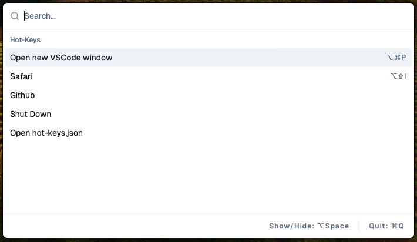

<div align="center" style="display:flex align-items:center justify-content:center">
    
    
</div>

# Hot-Keys-V2 

### Map commands to keyboard shortcuts (or execute them throught the UI)

## Built with

- [**Tauri**](https://tauri.app)
- [**React**](https://react.dev)
- [**shadcn/ui**](https://ui.shadcn.com)
- [**cmdk**](https://github.com/pacocoursey/cmdk)
- [**tailwindcss**](https://tailwindcss.com)
- [**Geist Font**](https://github.com/vercel/geist-font/blob/main/LICENSE.txt)

## Quick Start

Download and install the latest release.

Hot-Keys will read from a `hot-keys.json` file in your **_home directory_**.

### Example hot-keys.json

```bash
cd ~
```

```bash
touch hot-keys.json
```

```bash
# if using VSCode
code hot-keys.json
```

The `commands` field is your hot-keys. The `hotKey` field is optional if you do not want to take up a keyboard shortcut.

The `theme` field is for the UI-Theme. Options are `light` and `dark`.

The `toggleUI` field is for the showing and hiding the UI.

Whenever you edit your `hot-keys.json`, you will need to restart the app for the changes to take effect.

```json
{
  "theme": "light",
  "toggleUI": "Option+Space",
  "commands": [
    {
      "hotKey": "Option+Command+P",
      "command": "code -n",
      "displayName": "Open new VSCode window"
    },
    {
      "hotKey": "Option+Command+I",
      "command": "osascript -e 'quit app \"safari.app\"'",
      "displayName": "Close Safari"
    },
    {
      "command": "osascript -e 'quit app \"messages.app\"'",
      "displayName": "Close Messages"
    },
    {
      "command": "code ~/hot-keys.json",
      "displayName": "Open hot-keys.json"
    }
  ]
}
```

### A note on $PATH

If a command is not working, it may be due to `command not found`.

Try specifying the path to the command.

EX: `/usr/local/bin/code -n` instead of `code -n`.

You can get the path to a command via:

```bash
type -a code
```
